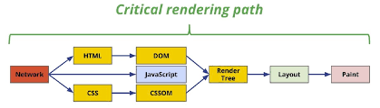
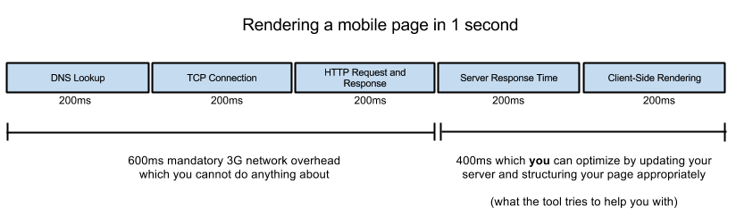

# Browsers

## CRP (Crytical Rendering Path)
[MDN doc](https://developer.mozilla.org/en-US/docs/Web/Performance/Critical_rendering_path) - Great Doc!

The Critical Rendering Path (CRP) is the sequence of steps that a browser takes to convert HTML, CSS, and JavaScript into a rendered web page. The critical rendering path includes the Document Object Model (DOM), CSS Object Model (CSSOM), render tree and layout (reflow).
The order

---

### TCP connection
The TCP handshake (TCP connection) is a three-step process that establishes a connection between a client and a server. It consists of the following steps:

1. SYN: The client sends a SYN packet to the server, indicating its desire to establish a connection.
2. SYN-ACK: The server responds with a SYN-ACK packet, acknowledging the client's request and indicating its willingness to establish a connection.
3. ACK: The client sends an ACK packet to the server, confirming the establishment of the connection.

During the TCP handshake, the client and server exchange IP addresses and other necessary information to establish a reliable connection.

Regarding the IP addresses, both the front-end (FE) and back-end (BE) send requests and responses directly to the client and service IP addresses. The client IP address is used to send the response back to the client, while the server IP address is used to route the request to the appropriate server.

## Async & Defer

[Article](https://www.linkedin.com/pulse/async-vs-defer-attributes-javascript-most-crucial-web-elias-soykat-cxndc/)

- `async` loads the script in parallel with HTML parsing, but as soon as the script is loaded, it executes it, pausing HTML parsing.
- `defer` loads the script and executes it only when the HTML document has been fully parsed and the DOM tree has been constructed. Defer scripts also maintain the order of script execution as declared - the earlier it is loaded, the earlier it will execute.

## Reflow and Repaint

- `Reflow` is the process of calculating positions and dimensions of elements, triggered by changes to the page's structure or style.
- `Repaint` updates visual appearance of elements.
